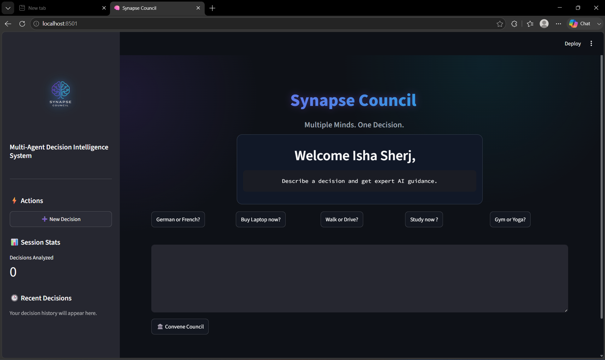
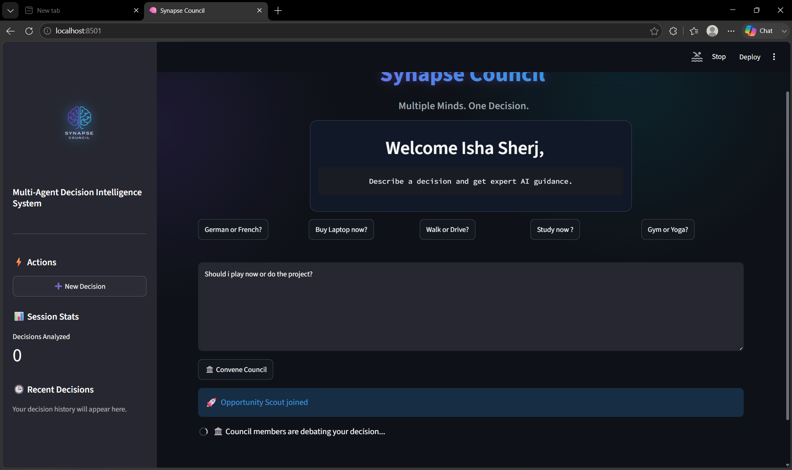
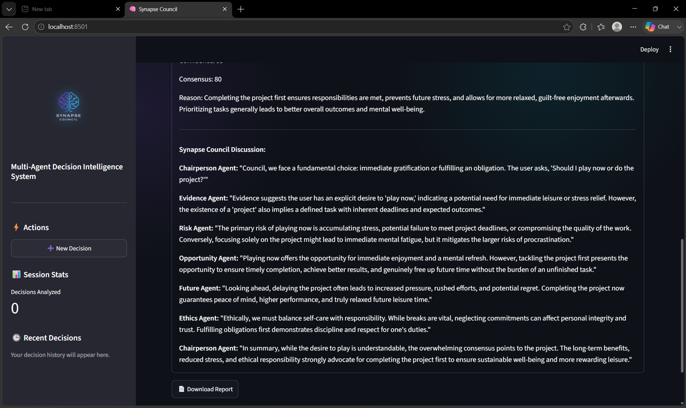
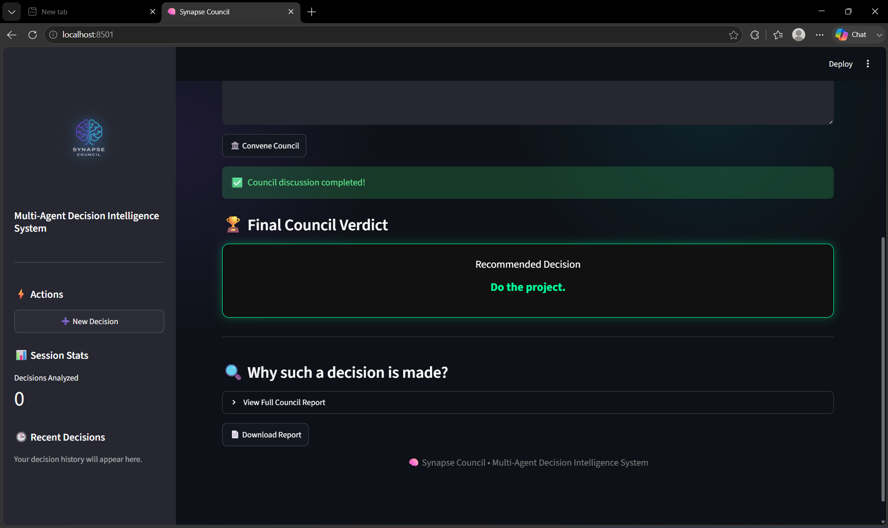
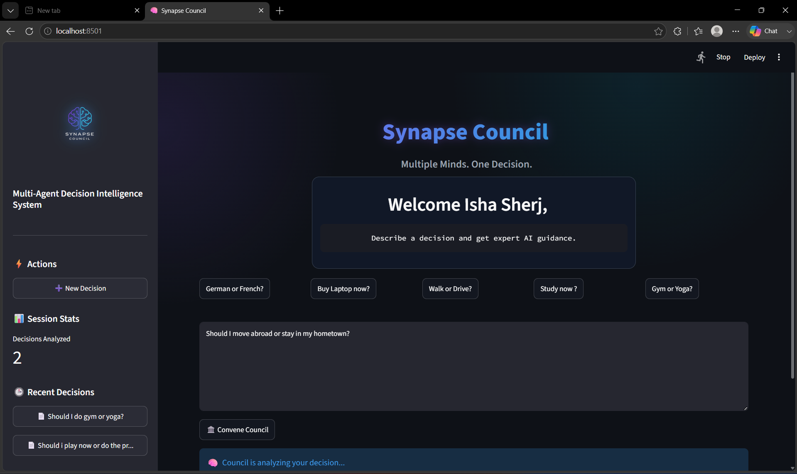

# Synapse Council

### A Multi-Agent Decision Intelligence System

Synapse Council is an AI-powered decision support platform that helps users make better decisions through collaborative AI reasoning.

Instead of relying on a single AI response, Synapse Council assembles a council of specialized AI agents that evaluate a decision from multiple perspectives before producing a final recommendation.

# Problem Statement

Important life, career, financial, and educational decisions are often made using incomplete information or a single perspective.

Users frequently struggle to simultaneously evaluate:

* Risks
* Opportunities
* Ethical implications
* Long-term consequences
* Supporting evidence

Traditional AI assistants typically provide a single answer, which may overlook important viewpoints.

# Solution

Synapse Council introduces a multi-agent approach to decision intelligence.
A council of specialized AI experts analyzes a user's decision from different perspectives and collaboratively produces a final recommendation.
This creates a more balanced, explainable, and trustworthy decision-making experience.

# Why AI Agents?

Different decisions require different forms of reasoning.
Instead of using a single AI assistant, Synapse Council distributes reasoning across multiple specialized agents.

### Evidence Agent
Examines facts, supporting information, and objective reasoning.

### Risk Agent
Identifies risks, uncertainties, and potential downsides.

### Opportunity Agent
Highlights benefits, advantages, and growth opportunities.

### Future Agent
Evaluates long-term consequences and future scenarios.

### Ethics Agent
Considers fairness, responsibility, and ethical concerns.

### Chairperson Agent
Synthesizes all viewpoints and generates the final verdict.

# Architecture

User Decision

    ↓

Evidence Agent

Risk Agent

Opportunity Agent

Future Agent

Ethics Agent

    ↓

Chairperson Agent

    ↓

Final Verdict

Consensus Analysis

Detailed Council Discussion

# Features

* Multi-agent decision analysis
* Consensus-based recommendations
* Explainable AI reasoning
* Decision history tracking
* Interactive Streamlit interface
* Structured council discussions
* Final verdict generation
* Session-based memory
* Professional user interface
* Easy download of the final report

# Technologies Used

### Frontend

* Streamlit

### Backend

* Python

### AI Model

* Google Gemini API

### Architecture

* Multi-Agent Decision System

### Supporting Libraries

* Python Regex
* Datetime
* Session State Management

# Kaggle Capstone Concepts Demonstrated

This project demonstrates multiple concepts from the Kaggle AI Agents Intensive Vibe Coding Course:

### Multi-Agent System

A council of specialized agents collaborates to analyze decisions.

### Agent Skills

Agents perform specialized reasoning tasks including:

* Risk analysis
* Evidence evaluation
* Opportunity discovery
* Ethical assessment
* Future forecasting

### Deployability

The system is deployable as a Streamlit application and can be run locally or hosted online.

# Installation

## Clone Repository

git clone (https://github.com/ishasherj1730-spec/synapse-council.git)

## Navigate Into Project

cd synapse-council

## Install Dependencies

pip install -r requirements.txt

## Configure Gemini API Key

Create a `.env` file and add:

GOOGLE_API_KEY=YOUR_API_KEY

## Run Application

streamlit run app.py

# Screenshots

## Homepage

## Joining of Agents

## Council report

## Final Verdict

## Decision History

# Example Use Cases

### Education

Should I pursue Data Science or Software Engineering?

### Career

Should I switch careers from Data Analysis to Machine Learning?

### Finance

Should I invest in stocks or mutual funds?

### Personal Development

Should I relocate to another city for better opportunities?

---

# Future Improvements

* MCP Integration
* Real-time web search
* Long-term memory
* Specialized industry councils
* Team decision support
* Voice interface
* Collaborative decision-making

---

# Security

* API keys are stored outside source code.
* Sensitive credentials are excluded through `.gitignore`.
* No secrets are committed to the repository.

---

# Author

Isha

Built for the Kaggle AI Agents: Intensive Vibe Coding Capstone Project.

